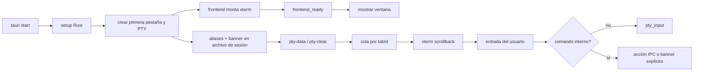

# Auditoría técnica — 2026-08-30

## Alcance

Revisión del checkout completo de WinSlim Terminal: entrada Svelte/Vite,
puente IPC, estado global, ciclo de vida PTY, detección de entornos, scripts de
build Windows/Linux, contratos, idiomas, pruebas y documentación. El inventario
base contiene 190 rutas Git; `src/` reúne 21 archivos, `src-tauri/src/` 66,
`scripts/` 36 y `windows/` + `linux/` 6. Los artefactos generados (`dist/`,
`target/`, `release/`, `node_modules/` y logs) quedan fuera del código fuente.

## Flujo verificado



El banner sigue una sola ruta visual: salida normal del PTY y scrollback de
xterm. El perfil predeterminado es «Solo esencial» (aprox. 5–8 líneas); el
perfil completo se solicita desde Ajustes o `:banner preset full`. El resize
solo cambia el viewport del PTY; no borra ni vuelve a insertar texto del
usuario. Una impresión posterior se serializa con la misma cola de salida y se
pospone mientras hay edición o salida pendiente.

## Controles ejecutados

| Área | Comando | Resultado |
|---|---|---|
| Batería estricta completa | `npm.cmd run check` | OK: enlaces 29 OK + 1 aviso no bloqueante, 16 fuentes, 71 WinGet, Svelte y 614 tests Rust |
| Contratos locales | `npm.cmd run check:local` | OK |
| Svelte/TypeScript | `npm.cmd exec -- svelte-check --tsconfig ./tsconfig.json` | OK (0 errores, 0 avisos) |
| Frontend productivo | `npm.cmd run build:fast` | OK (Vite, 144 módulos) |
| Formato Rust | `cargo fmt --manifest-path src-tauri/Cargo.toml --check` | OK |
| Lints Rust | `cargo clippy --manifest-path src-tauri/Cargo.toml -- -D warnings` | OK |
| Tests Rust | `cargo test --manifest-path src-tauri/Cargo.toml` | OK (614 tests) |
| Integridad de cambios | `git diff --check` | OK |

## Ejecución de release realizada

Se ejecutó la build canónica Windows con perfil release/LTO y batería ampliada:

```powershell
powershell -NoProfile -ExecutionPolicy Bypass -File windows/build.ps1 `
  -NoRun -NonInteractive -FullTests
```

Resultado final: OK en 377,4 s. El smoke nativo confirmó frontend, terminal y PTY;
la E2E de WebDriver completó 11 fases, 351 métricas y 0 errores en 67,3 s,
incluyendo cambios de shell, preferencias, idiomas, biblioteca, explorador,
proyectos, pestañas, rejilla de 1–4 paneles y matriz responsive.

Artefactos Windows:

| Artefacto | Tamaño | SHA-256 |
|---|---:|---|
| `release/WinSlimTerminal-1.4.4/winslim-terminal.exe` | 8 494 592 B | `9c6c3dea37132db84a4c83b33cbf22421ddbe22a4d99e50fca5ec50b5b34ec38` |
| `release/WinSlimTerminal-Unpacked-1.4.4.zip` | 4 437 814 B | `83117ba606f40af8670d4a495fdad1e2572f93c3c8698bf7dfbd7169d2be54aa` |
| `src-tauri/target/release/bundle/nsis/WinSlim Terminal_1.4.4_x64-setup.exe` | 265 230 009 B | `3e457984063d4c36db9e3b640de29d64894920b722faadebc3112ed25f391f1d` |

El instalador NSIS se generó correctamente con WebView2 offline. Está sin firma
AuthentiCode (`NotSigned`), por lo que debe firmarse en el pipeline de
distribución antes de publicarlo. No se instaló en el sistema para no modificar
Windows fuera del checkout.

También se ejecutó dentro de WSL Ubuntu:

```bash
bash linux/build.sh --no-run --no-extended-tests --non-interactive
```

Resultado final: OK en 789 s. Se generó y se arrancó mediante extracción el AppImage,
con smoke de frontend/IPC/xterm/PTY confirmado. Artefacto:

`release/LTerminal-1.4.4-x86_64.AppImage` — 92 285 432 B — SHA-256
`bca7c82651121a8f5b973bf37445e09ce7cb2fb5cb2f5cdf94ebd71b71afbd7c`.

Después se endureció la ruta por defecto Linux para instalar automáticamente
el driver E2E y se corrigió la selección apt en Ubuntu 26.04 (`webkitgtk-
webdriver`, no el paquete virtual `webkit2gtk-driver`). La build por defecto
actual (`bash linux/build.sh --no-run --non-interactive`, sin exclusiones)
genera AppImage, ejecuta checks estrictos, smoke, batería ampliada y E2E. El
artefacto final verificado es `release/LTerminal-1.4.4-x86_64.AppImage` —
92 293 624 B — SHA-256
`366d3c3dd08d165e3f6eeae33fffa815a8a98ee2275181aa191055b47b24d8fa`.
La E2E final pasó 11 fases, 136 eventos, 330 métricas y 0 errores en 51,6 s;
el validador independiente del informe también terminó OK.

La primera pasada Linux descubrió dos problemas de infraestructura de tests,
ambos corregidos: el auditor de Markdown recorría la copia temporal
`.node_modules.windows.*`, y el smoke buscaba el marcador de log obsoleto
`Ventana inicial mostrada`. La segunda pasada ejecutó 609 tests Rust sin fallos,
empaquetó el AppImage y pasó el smoke en 412 s.

La ejecución manual de la release real (`release/WinSlimTerminal-1.4.4/
winslim-terminal.exe`) abrió correctamente, registró `Frontend y terminal
preparados`, `app.ready-for-input` y `pty spawneado`, y se cerró de forma limpia.

Capturas E2E (10 PNG) y el informe JSON quedan en la carpeta temporal generada
por el runner. La revalidación de defaults dejó:
`%TEMP%/winslim-terminal-e2e-captures-e2e-16320-1788121514343/` y
`%TEMP%/winslim-terminal-e2e-89ddb5d1fe7949a5ae7fb88f0c20d8c6.json`.
Los logs persistentes están en
`%APPDATA%/winslim-terminal/logs/main.log` y `main.log.1`; la sesión final
`g9dr5h` terminó con 0 errores. El validador independiente Linux también pasó
(`linux/validate-release.sh`) y el ejercicio de host terminó con 12 pruebas,
42 herramientas ausentes y 0 fallos.

La revalidación específica de defaults se ejecutó con solo
`windows/build.ps1 -NoRun -NonInteractive` (sin `-Installer`, `-FullTests` ni
`-NoExtendedTests`): generó EXE + NSIS, ejecutó checks estrictos, smoke, la
batería ampliada y E2E (11 fases, 134 eventos, 350 métricas, 0 errores) en
668,5 s. `-NoInstaller` queda disponible para pedir únicamente el portable;
`dist:win:fast` ya lo usa explícitamente.

En Windows, la misma ruta sin opciones (`windows/build.ps1 -NoRun
-NonInteractive`) quedó validada con EXE + NSIS, checks estrictos, smoke,
batería ampliada y E2E: 11 fases, 134 eventos, 350 métricas, 0 errores en
668,5 s. Las exclusiones son siempre explícitas (`-NoInstaller`,
`-NoExtendedTests`, `-SkipChecks` o `--fast`).

El fallo reportado originalmente se reprodujo: CodeWeavers agotó los 8 000 ms
del verificador y abortó la build. Se corrigió clasificando ese dominio como
enlace externo no bloqueante (es un destino de navegador, no una fuente de
compilación): se sigue consultando y se muestra como aviso, pero el código de
salida permanece 0. Las URLs críticas conservan el modo estricto. Con la red
real, `npm.cmd run check:links` terminó en `29 OK, 1 aviso, 0 fallos` y la
build completa volvió a pasar; en WSL, las 31 URLs terminaron `31 OK`.

`npm run build` estricto añade comprobaciones externas de enlaces, fuentes de
instalación y catálogo Winget. Los enlaces de acciones informativas (como
CodeWeavers) se sondan pero, al no ser dependencias del binario, un timeout se
registra como aviso y no aborta la release; las fuentes críticas siguen siendo
fallos estrictos. En el sandbox las sondas pueden recibir `EACCES`; la variante
`build:fast` omite únicamente las comprobaciones externas y conserva el build
Vite. La build de release (`dist:win`, `dist:linux`) sigue usando la ruta
estricta y sus validadores PE/AppImage/E2E.

## Hallazgos y decisiones

1. Se eliminó la capa DOM `banner-header`; era la fuente de la superposición
   con selección, prompt y canvas de xterm.
2. `TerminalPane.svelte` queda reducido a un host xterm de tamaño completo;
   `App.svelte` es la única cola que ordena `pty-data` y `pty-clear`.
3. `pty_resize` y `pty_print_banner` son comandos separados: el primero nunca
   escribe texto; el segundo solo se llama por una acción explícita.
4. La ventana Tauri se crea oculta y se muestra desde `frontend_ready`, después
   de que CSS, grid y xterm estén montados; esto evita el frame blanco inicial.
5. Las sondas lentas de hardware/WSL/Docker/ADB no repintan banners ya visibles;
   el usuario conserva una salida estable y puede pedir una copia actualizada.
6. Las llamadas a procesos auxiliares pasan por `infrastructure/process.rs`,
   con timeout, salida capturada y aislamiento de variables de AppImage.
7. Los `unwrap/expect` restantes están en tests, expresiones compiladas una
   sola vez o invariantes internas; `clippy -D warnings` no detecta riesgos
   nuevos. Las operaciones externas de red y shell continúan encapsuladas en
    sus módulos y validadas por whitelist.
8. Los tests de `system_info` usan preferencias de fábrica bajo `cfg(test)`;
   así una ejecución E2E que haya guardado un perfil completo no altera los
   invariantes del conjunto unitario.

## Riesgos residuales

- WebDriver/WebView2 sí estuvo disponible en este host Windows y la E2E completa
  pasó. Para otros equipos seguirá siendo necesario disponer de WebView2 y una
  sesión gráfica real.
- Las comprobaciones que consultan GitHub, Winget o índices de instalación
  dependen de red y pueden fallar por proxy/DNS sin implicar un error del
  código local.
- La compatibilidad de shells y transportes (cmd, PowerShell, WSL, Docker,
  ADB y REPL) debe conservarse en cada release; por eso no se fusionaron sus
  adaptadores en un único archivo genérico.

## Cómo repetir la auditoría

```powershell
npm.cmd run check:local
npm.cmd exec -- svelte-check --tsconfig ./tsconfig.json
npm.cmd run build:fast
cargo fmt --manifest-path src-tauri/Cargo.toml --check
cargo clippy --manifest-path src-tauri/Cargo.toml -- -D warnings
cargo test --manifest-path src-tauri/Cargo.toml
git diff --check
```

Para una release completa usar `npm run check` y después el script de
plataforma correspondiente (`npm run dist:win` o `npm run dist:linux`).
