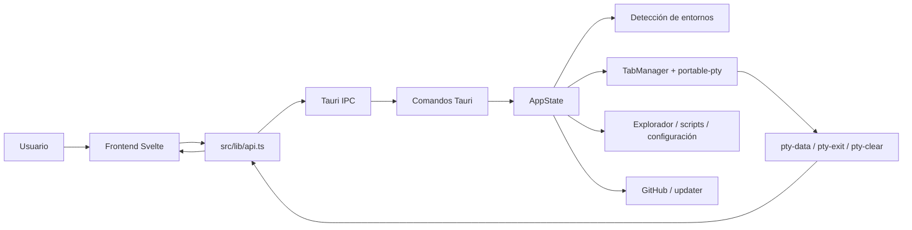
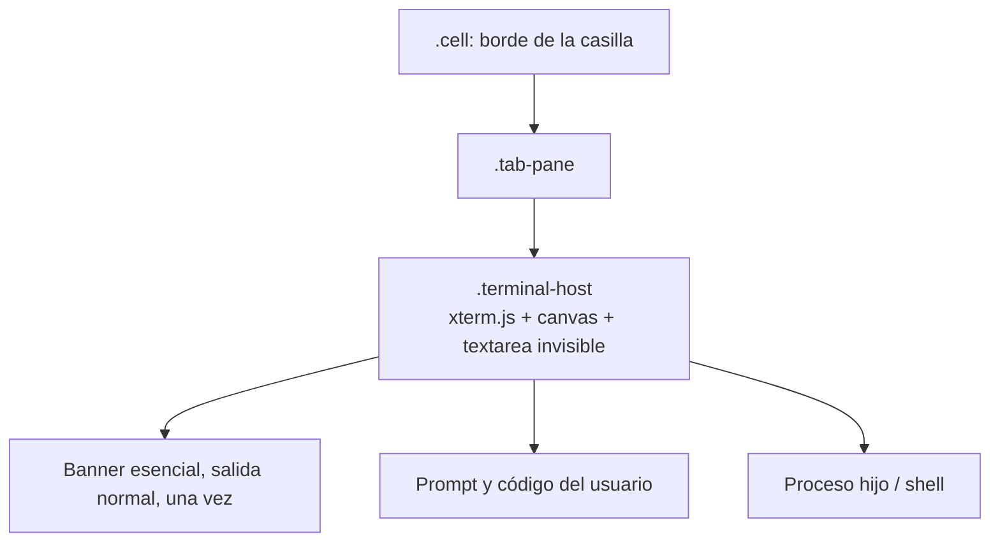
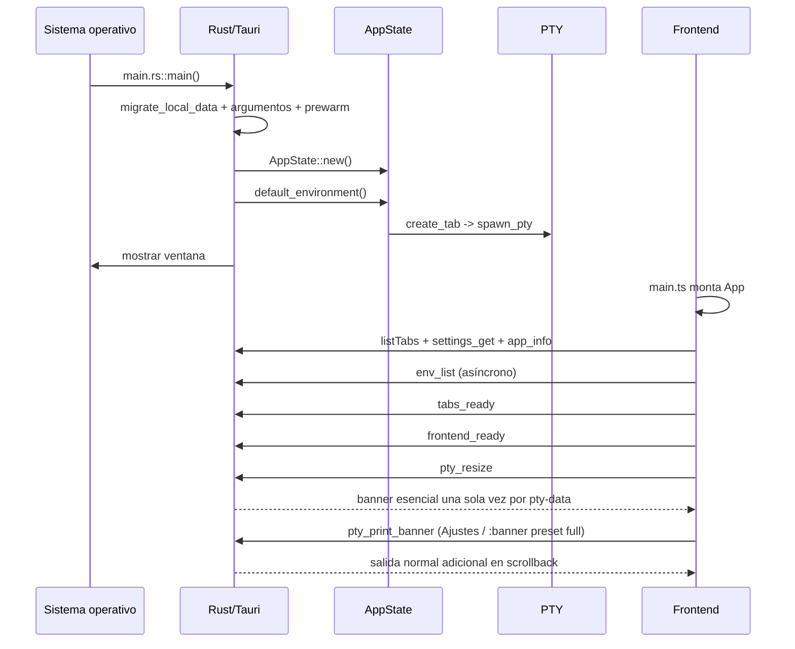
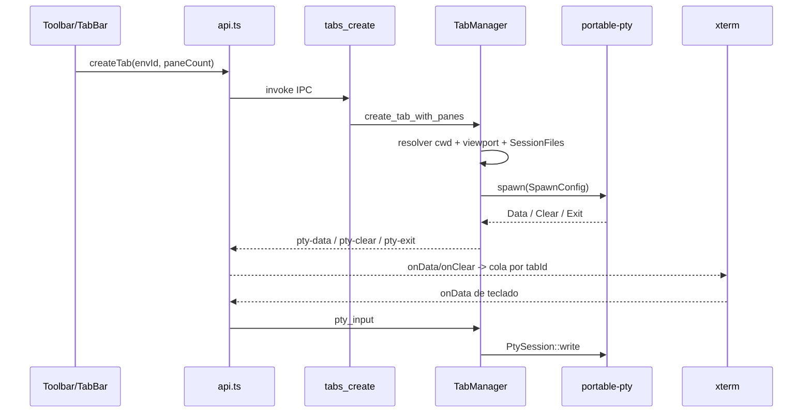

# Flujo completo de WinSlim Terminal / LTerminal

Este documento describe el estado actual del repositorio, desde una orden de
build hasta el cierre de una sesión PTY. El banner se conserva como salida
normal del terminal: se imprime una vez al iniciar la shell y comparte el
scrollback con el código, sin una capa superpuesta.

La captura adjunta por el usuario se trata como evidencia del síntoma, no como
una especificación de código. Las instrucciones de este documento describen el
proyecto; no sustituyen la petición del usuario.

## 1. Resumen de arquitectura

La aplicación tiene dos procesos lógicos:

* **Frontend Svelte/TypeScript**: estado reactivo, xterm.js, paneles y eventos
  de usuario. Sólo cruza IPC mediante `src/lib/api.ts`.
* **Backend Tauri/Rust**: sistema de archivos, procesos, detección de
  entornos, GitHub, actualización y PTY. Es la única parte con acceso al host.



### Banner y terminal

Cada `.cell` contiene un `TerminalPane` con un único nodo `terminal-host`, que
monta xterm. El banner viaja por el mismo PTY que el prompt y el código.



Consecuencias:

1. Redimensionar ajusta solamente las dimensiones de xterm; no repinta el
   banner ni mueve el cursor de la shell.
2. El banner y la edición del usuario están en el mismo flujo secuencial, por
   lo que nunca pueden solaparse como dos capas.
3. El perfil inicial es **Solo esencial** (aprox. 5–8 líneas). El perfil
   completo se solicita desde Ajustes o `:banner preset full`.
4. `clear/cls` limpia pantalla e historial y, por defecto, vuelve a imprimir el
   fastfetch esencial (`clearReprintBanner`). La preferencia se puede desactivar
   desde Ajustes; `sysinfo` y `:banner preset full` siguen siendo solicitudes
   explícitas de un banner.

### Cambios de idioma y recuperación del arranque

El idioma no solo afecta al DOM. `settings_save` y `settings_reset` actualizan
los banners y llaman a `TabManager::refresh_all_help_files`, que reconstruye la
ayuda, sus temas y el selector para cada pestaña que carga archivos del host.
Los alias ya apuntan a esas rutas estables, por lo que una shell viva empieza a
leer el idioma nuevo en la siguiente invocación de `ayuda` o `help`.

Al lanzar un archivo desde la Biblioteca, el ejecutor mantiene la sintaxis de
su tipo (`.ps1`, `.cmd`, `.sh`, Python, Node, etc.) y añade la variable de
entorno `LTERMINAL_LANGUAGE` al comando. Los scripts pueden leerla para
localizar sus menús y mensajes; WinSlim no traduce código arbitrario ni los
comandos propios del intérprete.

La ventana se crea inicialmente oculta para evitar el frame blanco. El camino
normal la muestra en `frontend_ready`, después de que xterm y la primera PTY
estén listos. Si `app.load()` falla antes de llegar ahí, el frontend invoca
`frontend_reveal` y deja visible `startupError`; así un fallo de recursos o IPC
no se confunde con una aplicación congelada.

## 2. Build: orden exacto

### Desarrollo

`npm ci` instala las versiones de `package-lock.json`. `npm start` ejecuta
Tauri en desarrollo; Tauri invoca `beforeDevCommand: npm run dev`, Vite escucha
en el puerto fijo 1420 y el backend Rust se recompila de forma incremental.

### Frontend

`npm run build` ejecuta `scripts/build-frontend.mjs`:

1. Salvo `LTERMINAL_SKIP_CHECKS=1`, lanza `svelte-check --tsconfig
   ./tsconfig.json`.
2. Ejecuta `vite build`, que genera `dist/` a partir de `index.html`,
   `src/main.ts`, `src/App.svelte`, los componentes y `src/styles/app.css`.

Antes de eso, el hook `prebuild` ejecuta `scripts/prebuild.mjs`:

1. `npm run check:workspace` comprueba permisos y carpetas de trabajo.
2. `npm run check:links` valida URLs según la política de red.
3. `npm run check:install-sources` sondea las fuentes externas del catálogo.
4. `npm run metadata:sync` sincroniza versión, identidad y metadatos entre
   `package.json`, Cargo y las configuraciones Tauri.

### `npm run check`

El orden es deliberadamente secuencial:


### Windows: `windows/build.ps1`

`windows/build.bat` sólo valida PowerShell, pasa los argumentos y propaga el
código de salida. El script PowerShell sigue este orden:

1. Interpreta opciones (`-Clean`, `-Fast`, `-Installer`, `-NoInstaller`, `-SkipChecks`,
   `-NoExtendedTests`, `-FullTests`, `-StrictTests`, `-CrossLinux`, etc.). Sin
   argumentos ofrece un selector interactivo con release completa como valor
   predeterminado (EXE + NSIS, checks estrictos, smoke, batería ampliada y E2E).
2. Comprueba Node, Cargo, MSVC o `rust-lld`, y prepara Visual Studio Build
   Tools si es necesario.
3. Valida la versión con `scripts/set-package-version.mjs`.
4. Comprueba `src-tauri/vendor/conpty/conpty.dll` y `OpenConsole.exe`.
5. Rechaza un servidor Vite en 1420 o una instancia de la aplicación que
   bloquee `esbuild.exe`/el ejecutable; puede detener un `esbuild` del proyecto.
6. Con `-Clean`, elimina `node_modules` y ejecuta `cargo clean`.
7. Ejecuta `npm ci` y, si Windows no puede vaciar un archivo bloqueado,
   reintenta con `npm install`.
8. Salvo `-SkipChecks`, ejecuta `npm run check` y analiza también marcadores de
   error de Cargo en la salida capturada.
9. Ejecuta `npm run tauri -- build --no-bundle`; con `-Installer` hace primero
   esa pasada, copia `WebView2Loader.dll` y después genera el NSIS offline.
10. Comprueba que el bundle frontend contiene marcadores de la versión actual,
    verifica el PE x64 y prepara `release/WinSlimTerminal-<versión>/` con el
    EXE, las tres DLL/EXE nativas y todos los recursos declarados.
11. Lanza un smoke con `LTERMINAL_SMOKE_TOKEN`, espera en el log `Ventana
    inicial preparada`, `pty spawneado` y `Frontend y terminal preparados`, y
    cierra la aplicación ordenadamente.
12. Salvo `-NoExtendedTests`, sondea shells y herramientas instaladas,
    prepara `tauri-driver`/EdgeDriver compatible con WebView2 y ejecuta
    `npm run e2e` sobre la carpeta portable recién creada.
13. Opcionalmente ejecuta `linux/build.sh` dentro de WSL (`-CrossLinux`).
14. Comprime el contenido como
    `release/WinSlimTerminal-Unpacked-<versión>.zip`, calcula SHA-256 y
    actualiza `release/SHA256SUMS.txt` de forma atómica.
15. Salvo `-NoRun`, inicia el EXE desempaquetado.

### Linux: `linux/build.sh`

1. Exige Bash, limpia variables heredadas de una AppImage y limita Cargo a dos
   trabajos salvo configuración explícita.
2. Interpreta opciones (`--fast`, `--clean`, `--skip-checks`, `--no-run`,
   `--no-install`, `--full-tests`, `--cross-windows`, etc.) y, si procede,
   ofrece el selector interactivo. Sin opciones, el AppImage, los checks,
   smoke, batería ampliada y E2E quedan activados por defecto.
3. Comprueba Node, Rust, WebKitGTK, IBus, `appimagetool`, iconos y runtime
   AppImage; puede descargar o reutilizar el runtime en caché.
4. Comprueba que no haya otra build/smoke bloqueando recursos y aísla
   `node_modules` de Windows si el checkout se comparte con WSL.
5. Instala dependencias faltantes según la distribución, sincroniza metadatos y
   ejecuta `npm run check` salvo `--skip-checks`.
6. Ejecuta `npm run tauri -- build --config src-tauri/tauri.linux.conf.json
   --verbose`, recrea el AppDir si hace falta y fuerza un único artefacto
   AppImage.
7. Verifica el frontend dentro del bundle, el runtime con `--appimage-version`,
   la arquitectura ELF y el árbol de AppImage.
8. Ejecuta el smoke gráfico si hay DISPLAY/WSLg; conserva el log si falla.
9. Publica `LTerminal-<versión>-<arquitectura>.AppImage`, actualiza SHA-256 y,
   salvo `--no-run`, la lanza.
10. Con `--full-tests`, prepara `tauri-driver`/`WebKitWebDriver` y ejecuta el
    mismo E2E. Con `--cross-windows` delega en `linux/build-windows.sh`.

La verificación final debe ejecutarse sobre el artefacto publicado, no solo
sobre `target/`: `linux/validate-release.sh` comprueba el runtime y
`--appimage-version`, mientras el smoke/E2E abre el AppImage y confirma la
primera PTY. Los avisos de WSLg (por ejemplo DRI3) o de herramientas opcionales
ausentes se registran como avisos; solo un fallo de ventana, IPC, PTY o informe
E2E detiene la build.

`linux/build-windows.sh` comprueba MinGW y el target GNU, usa un `CARGO_TARGET_DIR`
aislado, ejecuta `npm run build`, compila el PE Windows con Cargo, copia los
recursos del manifiesto y puede ejecutar tests/smoke bajo Wine.

## 3. Arranque de la aplicación

El orden real de `src-tauri/src/lib.rs::run` es:

1. `migrate_local_data()` mueve datos de la ruta antigua a la canónica.
2. Si se pasó `--import-profile`, `commands::import_profile_file` importa el
   perfil y termina con código 1 si no es válido.
3. `open_path_argument()` recoge una ruta inicial para el directorio de trabajo.
4. `system_info::prewarm_hardware_info()` empieza a calentar hardware.
5. `github::shared_client()` crea el cliente bloqueante compartido.
6. Se resuelve identidad/plataforma, ConPTY y se escribe el banner de log
   `ARRANQUE`.
7. Se crea `Arc<AppState>`; su constructor carga preferencias, viewport y
   `TabManager`.
8. `tauri::generate_context!()` carga configuración, recursos y capabilities.
9. Se registran opener, dialog y clipboard; se registra `AppState` y todos los
   comandos Tauri.
10. En `setup`, `default_environment()` crea la primera pestaña mientras la
    ventana permanece oculta. La shell prepara aliases, banner esencial y
    prompt dentro del PTY.
11. Se fija el título por plataforma y se lanza `commands_update::on_startup`
    en segundo plano. `frontend_ready` muestra la ventana sólo después de que
    CSS, grid y xterm estén montados, evitando el frame blanco inicial.
12. Al destruirse la ventana o recibir `RunEvent::Exit`, se matan todos los PTY,
    se limpian temporales de sesión y se registra `CIERRE`.



## 4. Arranque del frontend y ciclo de vida de una pestaña

### `src/main.ts` y `App.svelte`

`main.ts` importa Svelte, `App` y CSS, obtiene `#app` y ejecuta `mount(App,
{ target })`.

`App.svelte::onMount` registra, en este orden, los listeners de cambio de
entorno, apertura de Ajustes, `pty-data`, `pty-clear`, `pty-exit`, `tab-closed`,
`env-changed`, `envs-updated`, `command-not-found` y `update-available`; marca
`frontend-mounted`; inicia `app.load()`; instala captura de errores y los
atajos globales. Cuando `app.load()` termina, activa `ready` y el grid monta
los `TerminalPane`. Cada `TerminalPane` conserva un único xterm; los cambios
del banner se solicitan explícitamente y se escriben como salida normal.

`app.load()` hace tres llamadas en paralelo (`tabs_list`, `settings_get`,
`app_info`), aplica preferencias/tema, fija `document.title` y dispara
`loadEnvironments()` sin bloquear las pestañas.

### Creación y salida PTY



Orden de preparación de una pestaña:

1. Se asigna `tabId`, generación y entorno.
2. `spawn_cwd` valida el directorio; `pty::spawn` crea el pseudoterminal.
3. `system_info::build_banner` genera el texto según columnas/filas,
   preferencias y número de paneles.
4. `session_files::write_session_files` crea aliases, ayuda y archivos
   `banner-<tab>.txt`; la sesión normal usa `initial_banner: true`.
5. Se guarda el comando de inicialización pendiente hasta que el frontend
   diga `tabs_ready`/`frontend_ready`.
6. La salida del proceso se decodifica en `stream.rs`; `ClearSplitter` convierte
   los marcadores de `clear/cls` en `pty-clear` y el resto en `pty-data`.
7. `TabManager::inspect_output` observa cwd y comandos ausentes; sólo después
   envía los datos al frontend.
8. `App.svelte` serializa cada pestaña en `outputQueues`, escribe xterm y hace
   `scrollToBottom`; el banner inicial forma parte de esa misma cola.

Las sondas lentas no provocan repintados automáticos: el banner que ya salió
permanece estable. Ajustes y `:banner preset full` llaman a `pty_print_banner`,
que escribe una nueva copia como salida normal cuando la línea del usuario está
libre.

### Resize y fastfetch

`TerminalPane::fitAndReport` mide `terminal-host`, usa
`FitAddon.proposeDimensions`, ejecuta `term.resize` e informa `pty_resize` con
debounce de 60 ms. El resize no repinta el banner ni mueve el cursor. Ajustes
y `:banner preset full` llaman a `pty_print_banner`, que escribe texto normal
en el scrollback.

## 5. Flujos de usuario

### Pestañas, división y foco

* `Toolbar` crea pestañas, selecciona idioma, entorno y abre logs/paneles.
* `TabBar` activa, arrastra/reordena y cierra pestañas; clic central también
  cierra.
* `app.cyclePanes()` rota 1→2→3→4, abre las pestañas que faltan en el entorno
  activo y conserva el orden. `navigatePaneDirection` mueve el foco según la
  geometría de 2, 3 o 4 celdas.
* Sólo la pestaña activa recibe entrada y acciones de panel; las ocultas
  conservan xterm e historial mediante `visibility`, no `display: none`.

### Entornos

`environments::detect_system_shells` descubre cmd, PowerShell, Git Bash y
shells POSIX. `wsl`, `docker`, `android` y `languages` amplían el inventario.
La detección rápida llena el selector; la detección completa posterior emite
`envs-updated`. Cambiar entorno llama `env_switch`, mata la generación anterior,
crea otro PTY y emite `env-changed` cuando la etiqueta real está confirmada.

### Comandos internos

`TerminalPane` mantiene un espejo seguro de la línea ASCII. Al pulsar Enter en
una línea que empieza por `:` (o en `@darkeiser003`/`@christianlg97`), llama a
`internal_command_parse`, borra la línea con DEL y ejecuta en este orden lógico:

* `:config` abre Ajustes.
* `:settings` es el mismo comando con un nombre alternativo.
* `:reload` refresca entornos.
* `:shell list|current|<id o nombre>` enumera, consulta o cambia el entorno de
  la pestaña actual; `:env` y `:environment` son alias del mismo comando.
* `:repl <nombre>` crea una pestaña para el REPL detectado.
* `:panel <settings|deps|projects|scripts|explorer|close>` abre/cierra paneles;
  `:open` es su alias.
* `:theme`, `:font` y `:language` enumeran o aplican los catálogos disponibles.
* `:terminal list|<parámetro> <valor>` consulta o cambia los parámetros de
  xterm (fuente, cursor, colores, scrollback, densidad y comportamiento).
* `:panes 1|2|3|4|cycle` fija o rota la rejilla visible; `:layout` y `:grid`
  son alias.
* `:banner hide|show|toggle|preset|list` guarda `bannerHiddenItems`; el cambio
  imprime una copia normal del banner cuando termina la edición. El preset
  predeterminado **compact/solo esencial** oculta host, kernel, entorno, placa,
  GPU, almacenamiento y fecha (5–8 líneas visibles).
* `:banner preset full` solicita explícitamente el perfil completo.
* `:quick-actions on|off|toggle|list` guarda `showQuickActions`.
* `:help`/`:alias` invoca el alias de ayuda de la shell cuando el transporte
  puede leer archivos del host; en REPL/contenedor muestra fallback.
* Las órdenes sin prefijo `:` no entran en esta ruta: se envían a la shell para
  que las resuelvan sus alias, funciones y comandos nativos.
* Los dos alias de créditos escriben enlaces, no ejecutan comandos del host.

### Panel de entorno y dependencias

`DependenciesPanel.load()` pide `install_list` para pintar inmediatamente y
`refreshInstallActions()` vuelve a detectar PATH, WSL, Docker y ADB con una
   caché de 60 s. Los grupos se ordenan instalado→nombre. `run(action)` sólo
   envía el `action.id`; Rust valida la whitelist, adapta la shell y escribe el
   comando visible en la terminal activa. La instalación nunca ocurre en
   segundo plano.

### Scripts

`ScriptsPanel` alterna Biblioteca/Ruta actual, normaliza filtros y profundidad,
   escanea con `scripts_list`/`scripts_list_here`, agrupa por subdirectorio y
   conserva favoritos mediante `scripts_pin`. Ejecutar llama a `scripts_run`;
   si la extensión necesita otra familia de shell, Rust crea/adopta una pestaña
   compatible y devuelve `tabId`. Abrir usa `scripts_open` y el visor del
   sistema. Los scripts integrados registran los alias `adb-manager`,
   `docker-manager`, `kubernetes-manager`, `network-manager`, `service-manager`
   y `ssh-manager`; la ayuda de cada sesión enumera además los nombres de los
   scripts personales detectados.

### Explorador

`ExplorerSidebar` carga `explorer_follow` al cambiar de pestaña. Crear,
renombrar, copiar/cortar, pegar y enviar a papelera llaman respectivamente a
`explorer_create`, `explorer_rename`, `explorer_clip`, `explorer_paste` y
`explorer_trash`. El backend valida que la entrada pertenezca al directorio
mostrado; `openDirectory` ofrece gestores instalados o una acción de
Dependencias. Doble clic abre directorios o archivos con `viewers.rs`.

### Proyectos GitHub

`ProjectsPanel` carga catálogo local y repositorios clonados sin red. Buscar
llama a `projects_lookup`, que valida owner/repo y sanea la respuesta GitHub.
`projects_release` obtiene la release; `projects_download_release` sólo acepta
assets de esa release y, si es un comprimido, escribe el comando de extracción
en la terminal. `projects_run` escribe `git clone` o `git pull`; `projects_cd`
lleva la shell al repositorio. Pins y carpeta de proyectos se guardan en
configuración.

### Ajustes, plugins y actualización

`SettingsPanel` carga preferencias/plugins al abrir, edita tema, colores,
fuente, cursor, layout, banner, atajos, entornos visibles y perfiles. `save`
normaliza atajos y usa la cola de `app.savePreferences`; `reset` vuelve a
defaults. Exportar/importar usa diálogos nativos y archivos portables.
Plugins se listan, habilitan, instalan por manifiesto y eliminan mediante
`config/plugins.rs`.

`updater::on_startup` comprueba en segundo plano una release. El panel puede
llamar `update_check`; `update_install` descarga, verifica, aplica en el
directorio de instalación y reinicia. Las notificaciones de progreso son
`update-progress` y la disponibilidad inicial `update-available`.

## 6. Inventario de archivos versionados

El árbol fuente auditado contiene **190 archivos Git**. Esta documentación se
mantiene junto al checkout y se incluye en la entrega; los directorios generados
`node_modules/`, `dist/`, `release/`, `src-tauri/target/` y logs no forman parte
del inventario fuente y se excluyen de las comprobaciones de documentación.

### Raíz y configuración

| Archivo | Responsabilidad |
|---|---|
| `.gitattributes`, `.gitignore` | Normalización Git y exclusiones. |
| `index.html` | Entrada HTML de Vite. |
| `package.json`, `package-lock.json` | Dependencias, scripts npm y versiones bloqueadas. |
| `svelte.config.js`, `vite.config.ts`, `tsconfig.json` | Compilación Svelte/Vite/TypeScript. |
| `README.md` | Guía pública de uso, build, seguridad y pruebas. |
| `AUDIT-2026-08-28.md` | Auditoría histórica; no es una instrucción de ejecución. |

### Frontend (`src/`, 21 archivos)

| Archivo | Función principal |
|---|---|
| `main.ts` | Monta Svelte en `#app`. |
| `App.svelte` | Arranque, listeners, cola PTY, layout y atajos globales. |
| `components/TerminalPane.svelte` | xterm, input, selección, menú y resize; el banner se imprime en la salida PTY normal. |
| `components/Toolbar.svelte` | Entornos, idioma, acciones globales y logs. |
| `components/TabBar.svelte` | Pestañas, drag/drop, cierre y visualización de división. |
| `components/Panel.svelte` | Modal redimensionable con focus trap y persistencia de tamaño. |
| `components/ExplorerSidebar.svelte` | Navegación y operaciones de archivos. |
| `components/ScriptsPanel.svelte` | Escaneo, filtros, favoritos y ejecución. |
| `components/DependenciesPanel.svelte` | Acciones de instalación y actualización. |
| `components/ProjectsPanel.svelte` | Catálogo GitHub, releases y repositorios locales. |
| `components/SettingsPanel.svelte` | Preferencias, plugins, perfiles y updater. |
| `lib/api.ts` | Único puente `invoke/listen`, agrupado por dominio. |
| `lib/appState.svelte.ts` | Estado global, tabs, panes, entornos y preferencias. |
| `lib/types.ts` | Contratos serializados TypeScript/Rust. |
| `lib/localization.ts` | Comparación y normalización localizada. |
| `lib/panels.svelte.ts` | Estado de paneles abiertos. |
| `lib/performance.ts` | Marcas, medidas y métricas IPC/UI. |
| `lib/shortcuts.ts` | Parseo y comparación de atajos. |
| `lib/terminalRegistry.ts` | Registro de instancias xterm por `tabId`. |
| `lib/theme.ts` | Paletas, fuentes, cursor y aplicación CSS. |
| `styles/app.css` | Tokens y estilos globales. |

Símbolos frontend que aparecen en las trazas:

* `App.svelte`: `loadDeps`, `loadSettings`, `loadScripts`, `loadProjects`,
  `onShortcut` y el `onMount` que serializa `pty-data`/`pty-clear` por pestaña.
* `components/TerminalPane.svelte`: `configureBanner`,
  `configureQuickActions`, `runInternal`, `completeRepl`, `terminalPromptVisible`,
  `requestBannerPrint`, `fitAndReport`,
  `editableSelection`, `deleteEditableSelection` y `pasteFromClipboard`.
* `lib/appState.svelte.ts`: `load`, `loadEnvironments`, `refreshEnvironments`,
  `cyclePanes`, `navigatePaneDirection`, `createTab`, `closeTab`,
  `activateTab`, `savePreferences` y `resetPreferences`.
* `lib/api.ts`: `listTabs`, `createTab`, `closeTab`, `activateTab`,
  `markTabReady`, `markFrontendReady`, `sendInput`, `resize`, `printBanner`,
  las operaciones `list/run` de scripts, explorador,
  proyectos y dependencias, preferencias/perfil/plugins, y los listeners
  `onData`, `onClear`, `onExit`, `onEnvironmentChanged`,
  `onEnvironmentsUpdated`, `onCommandNotFound` y updater.
* `lib/theme.ts`: `applyTheme`, `terminalTheme`, `terminalFont`,
  `cursorOptions`; `lib/shortcuts.ts`: `normalizeShortcut` y
  `matchesShortcut`; `lib/terminalRegistry.ts`: `registerTerminal`,
  `unregisterTerminal`, `getTerminal`.

### Backend Rust (`src-tauri/src/`)

| Módulo | Archivos y responsabilidad |
|---|---|
| `lib.rs`, `main.rs` | Entrada, migración, plugins, registro de comandos y cierre. |
| `app/` | `commands.rs` expone tabs/PTY/settings/logs; `panel_commands.rs` expone scripts/explorer; `state.rs` contiene `AppState`. |
| `config/` | `i18n`, identidad, rutas, migración, plugins, preferencias y settings JSON/TOML. |
| `environments/` | `mod.rs` y adaptadores WSL, Docker, Android y lenguajes. |
| `terminal/` | `pty`, `tabs`, `stream`, aliases, cwd, shell paths, sesiones y comandos internos. |
| `platform/` | Traits y adaptadores Windows/Linux, hardware, papelera e integración Windows. |
| `explorer/` | Seguridad de rutas, listado y gestores/visores. |
| `scripts/` | Tipos, escaneo, pins y comandos de lanzamiento. |
| `packages/` | Catálogo de acciones, alias de gestores y sugerencias de comando ausente. |
| `projects/` | Comandos de panel y cliente/saneamiento GitHub. |
| `system/` | Detección de virtualización. |
| `updater/` | Consulta, verificación, aplicación y limpieza de releases. |
| `infrastructure/` | Logger, procesos hijos y caché/PATH. |

### Índice de símbolos públicos por archivo

Este índice complementa el mapa de módulos con los entry points que se pueden
seguir durante una traza. Los helpers privados y los cuerpos de los tests no
son API de otro módulo, pero sus nombres aparecen en el código fuente junto a
estas funciones.

| Archivo | Tipos y funciones públicas |
|---|---|
| `app/commands.rs` | `tabs_list`, `tabs_create`, `tabs_close`, `tabs_activate`, `tabs_ready`, `frontend_ready`, `pty_input`, `internal_command_parse`, `pty_resize`, `pty_print_banner`, `env_list`, `env_refresh`, `env_switch`, `settings_get`, `settings_save`, `settings_reset`, `import_profile_file`, `profile_import_argument`, `open_path_argument`, `profile_export`, `profile_import`, `app_info`, `log_frontend_error`, `log_frontend_performance`, `log_open_folder`. Tipos: `EnvironmentList`, `PreferencesPayload`, `ProfileTransferResult`, `AppInfo`, `CollaboratorCredit`, `FrontendPerformancePayload`. |
| `app/panel_commands.rs` | `scripts_list`, `scripts_list_here`, `scripts_pick_target`, `scripts_open`, `scripts_cd`, `scripts_cd_directory`, `scripts_pin`, `scripts_run`, `explorer_list`, `explorer_follow`, `explorer_create`, `explorer_open`, `explorer_rename`, `explorer_clip`, `explorer_paste`, `explorer_trash`, `explorer_cd`, `explorer_open_directory`, `explorer_open_directory_with`. Tipos: `FilterOption`, `ScriptsPanel`, `ActionResult`, `OpenDirectoryResult`. |
| `app/state.rs` | Tipo `AppState`, `ClipboardItem`; métodos de inventario, whitelists, preferencias, repositorios, releases, acciones de instalación y `start_full_detection`. |
| `config/i18n.rs` | `resolve_language`, `interpolate`, `translate`, `group_key_for`, `verb_key_for`, `active_language`, `catalog_for`, `system_locale`; tipos `Language`, `Translator`, `CatalogPayload`. |
| `config/identity.rs` | `identity_for_platform`, `current`; tipo `Identity`. |
| `config/install_dir.rs` | `current`, `appimage_path`, `is_development_build`, `staging`, `is_self_repository`. |
| `config/migration.rs` | `migrate_user_data`; tipo `MigrationReport`. |
| `config/paths.rs` | `app_data_dir`, `user_data_dir`, `home_dir`, `documents_dir`, `temp_dir`, `default_scripts_dir`, `default_projects_dir`, `session_dir`, `home_cwd`. |
| `config/plugins.rs` | `export_bundle`, `import_bundle`, `enabled_technologies`, `plugins_list`, `plugins_set_enabled`, `plugins_install`, `plugins_remove`; tipos `PluginTechnology`, `PluginTransfer`, `PluginInfo`. |
| `config/preferences.rs` | `theme_by_id`, `sanitize_preferences`, `current`; tipos `Palette`, `ThemePreset`, `FontFamily`, `Preferences`. |
| `config/settings.rs` | `settings_path`, `load_settings`, `save_settings`, `save_key`, `string_setting`. |
| `environments/mod.rs` | `is_git_bash_path`, `find_git_bash`, `detect_system_shells`, `detect_environments`, `default_env_id`; tipos `Transport`, `ShellKind`, `Environment`, `Inventory`. |
| `environments/android.rs` | `find_adb_path`, `ensure_adb_on_path`, `parse_devices`, `device_label`, `detect_android_environments`; tipos `Device`, `AndroidInventory`. |
| `environments/docker.rs` | `is_daemon_ready`, `start_docker_daemon`, `wait_for_daemon`, `parse_images`, `parse_running_containers`, `detect_docker_environments`; tipos `StartResult`, `RunningContainer`, `DockerInventory`. |
| `environments/languages.rs` | `detect_language_environments`, `unix_language_executables`, `detect_wsl_language_environments`; tipo `Probe`. |
| `environments/wsl.rs` | `decode_wsl_output`, `parse_installed_distros`, `parse_online_distros`, `probe_distro`, `reset_cache`, `get_wsl_context`; tipos `OnlineDistro`, `InstalledDistro`, `WslContext`, `ContextOptions`. |
| `explorer/files.rs` | `is_windows_style_path`, `is_safe_entry_name`, `resolve_child_path`, `parent_directory`, `list_directory`, `create_entry`, `rename_entry`, `available_copy_name`, `is_inside`, `paste_entry`; tipos `EntryKind`, `Entry`, `Listing`, `FsResult`. |
| `explorer/viewers.rs` | `platform_key`, `viewer_category_for`, `suggest_viewer`, `file_managers_for`, `file_manager_by_id`, `file_manager_choices`, `file_manager_for_desktop`, `default_linux_file_manager`, `open_linux_associated_path`, `open_linux_directory`; tipos `ViewerSuggestion`, `FileManager`, `InstalledManager`, `InstallableManager`, `ManagerChoices`. |
| `infrastructure/logger.rs` | `log_dir`, `write`, `banner`; tipo `Level`. |
| `infrastructure/path_env.rs` | `clear_which_cache`, `path_separator`, `split_path`, `path_key`, `which`, `is_tool_installed`, `add_to_process_path`, `refresh_system_path`; tipo `PathRefresh`. |
| `infrastructure/process.rs` | `child_environment`, `sanitize_child_environment`, `hidden_command`, `run_with_timeout`, `output_text`. |
| `packages/actions.rs` | `linux_tool_executables`, `get_install_actions`; tipos `InstallAction`, `InstallContext`. |
| `packages/aliases.rs` | `windows_manager_by_id`, `detect_windows_manager`, `build_package_alias_lines`; tipo `WindowsManager`, enum `Action`. |
| `packages/command_not_found.rs` | `detect_missing_command`, `resolve_tool_suggestion`; tipos `ToolSuggestion`, `SuggestionContext`. |
| `packages/commands.rs` | `install_list`, `install_refresh`, `install_run`; tipos `InstallList`, `InstallRunResult`. |
| `platform/mod.rs` | `host`; adaptadores `WindowsPlatform`/`LinuxPlatform` implementan `HostPlatform`. |
| `platform/system_info.rs` | `clean_identity_value`, `os_identity`, `banner_data_ready`, `hardware_data_ready`, `disks_data_ready`, `prewarm_hardware_info`, `motherboard_info`, `gpu_info`, `ram_speed_info`, `build_banner`; tipo `OsIdentity`. |
| `platform/recycle.rs` | `send_to_trash`. |
| `platform/traits.rs` | Traits `ProcessPlatform`, `PathPlatform`, `HostPlatform`. |
| `platform/windows_integration.rs` | `status`, `set_enabled`, `windows_integration_status`, `windows_integration_set`; tipo `WindowsIntegrationStatus`. |
| `projects/github.rs` | `is_github_owner`, `is_github_repo_name`, `parse_full_name`, `parse_github_target`, `sanitize_profile`, `sanitize_repository`, `repository_from_full_name`, `is_allowed_asset_url`, `archive_kind_for`, `sanitize_asset`, `sanitize_release`, `normalize_catalog`, `default_catalog`, `load_catalog`, `merge_pins`, `local_repository_state`, `projects_folder`, `list_local_repositories`, `count_local_repositories`, `build_git_command`, `build_extract_command`, `shared_client`; tipos `FullName`, `Target`, `Profile`, `Repository`, `Asset`, `Release`, `Catalog`, `LocalState`, `LocalRepository`, `GitPlan`, `ExtractPlan`, `RateLimit`, `ApiError`, `Lookup`, `GithubClient`. |
| `projects/commands.rs` | `projects_state_get`, `projects_downloaded`, `projects_cd`, `projects_lookup`, `projects_release`, `projects_download_release`, `projects_pin`, `projects_choose_folder`, `projects_open_github`, `projects_run`; tipos de payload `PublicRepository`, `Owner`, `ProjectsState`, `PublicProfile`, `LookupResult`, `ReleaseResult`, `DownloadResult`, `PinResult`, `GitRunResult`. |
| `scripts/scan.rs` | `nsudo_available`, `normalize_here_depth`, `list_scripts`, `describe_path`, `list_all_scripts`; tipos `ScriptEntry`, `StopReason`, `ScanInfo`, `ScanResult`, `Scope`, `ScanOptions`. |
| `scripts/types.rs` | `filters_for_platform`, `file_filters`, `all_categories`, `default_categories_for`, `default_categories`, `default_here_categories`, `normalize_categories`, `script_type_for_ext`, `interpreter_for_ext`, `resource_type_for_ext`; tipos `ScriptType`, `FileCategory`, `FileFilter`. |
| `scripts/launch.rs` | `build_launch_command`, `build_cd_command`, `environment_kinds_for_script`, `resolve_script_aliases`; tipo `LaunchContext`. |
| `scripts/pins.rs` | `load`, `toggle`, `same_path`, `contains`, `patch`, `resolve`. |
| `terminal/pty.rs` | `sideloaded_conpty`, `spawn`; tipos `Viewport`, `SpawnConfig`, `PtySession`. |
| `terminal/stream.rs` | Tipos `PtyEvent`, `Utf8Decoder`, `ClearSplitter`; sus métodos decodifican UTF-8 y separan marcadores `clear/cls`. |
| `terminal/tabs.rs` | `scripts_folder`, `valid_viewport`; tipo `TabManager` y eventos serializables `DataEvent`, `ExitEvent`, `TabIdEvent`, `TabClosedEvent`, `CommandNotFoundEvent`, `EnvChangedEvent`, `TabSummary`, `TabList`. Métodos: crear/spawn/escribir/redimensionar/activar/cerrar/inspeccionar/refrescar/shutdown. |
| `terminal/session_files.rs` | `to_console_ascii`, `write_session_files`, `refresh_banner_files`, `remove_for_tab`, `cleanup`, `dir`; tipos `SessionFiles`, `SessionRequest`. |
| `terminal/aliases.rs` | `unix_aliases`, `clear_command`, `help_topic_path`, `build_cmd_help_dispatcher`, `help_runner_path`, `build_help_runner`, `build_help_text`, `build_help_topic_text`, `transport_loads_host_files`, `build_init_script`, `build_init_invocation`; tipos `HelpOptions`, `HelpTopic`, `ScriptAlias`, `InitOptions`, `InitScript`. |
| `terminal/current_dir.rs` | `is_windows_host_path`, `join_host_path`, `strip_ansi`, `wsl_path_to_windows`, `msys_path_to_windows`, `wine_path_to_posix`, `map_remote_path`, `detect_current_directory`. |
| `terminal/shell_paths.rs` | `to_msys_path`, `to_wsl_path`, `unix_path_for`. |
| `terminal/spawn_cwd.rs` | `usable_spawn_cwd`, `resolve_spawn_cwd`. |
| `terminal/internal_commands.rs` | `parse`; tipo `InternalCommand`. |
| `terminal/console_ui.rs` | `decorate`; tipo `Notice`. |
| `updater/self_update.rs` | `asset_for_platform`, `payload_root`, `verify_payload`, `apply`, `cleanup`, `binary_name`; tipos `Version`, `UpdateStatus`. |
| `updater/commands.rs` | `check`, `update_check`, `update_install`, `on_startup`; tipo `UpdateResult`. |
| `system/virtualization.rs` | `parse_probe`, `detect`; tipo `Virtualization`. |

Funciones públicas relevantes por módulo:

* `app/commands.rs`: `tabs_list`, `tabs_create`, `tabs_close`, `tabs_activate`,
  `tabs_ready`, `frontend_ready`, `pty_input`, `internal_command_parse`,
  `pty_resize`, `pty_print_banner`, `env_list`, `env_refresh`, `env_switch`,
  `settings_get/save/reset`, `profile_export/import`, `app_info`,
  `log_frontend_error/performance/open_folder`.
* `app/panel_commands.rs`: todas las operaciones `scripts_*` y `explorer_*`.
* `app/state.rs`: `AppState::new`, inventario rápido/completo, whitelist de
  repositorios, acciones de instalación, clipboard y generaciones de escaneo.
* `terminal/tabs.rs`: `TabManager::create_tab`, `spawn_pty`, `write`,
  `resize`, `print_banner`, `activate`, `close`, `shutdown`, `on_pty_event`.
* `terminal/pty.rs`: `sideloaded_conpty`, `Viewport`, `SpawnConfig`,
  `PtySession` y `spawn`.
* `terminal/stream.rs`: `PtyEvent`, `Utf8Decoder` y `ClearSplitter`.
* `terminal/aliases.rs`: alias canónicos, `clear_command`, `sysinfo`, ayuda e
  `build_init_script`; `transport_loads_host_files` decide si la shell puede
  leer temporales del host.
* `platform/system_info.rs`: identidad, prewarm y `build_banner`.
* `environments/mod.rs`: `detect_system_shells`, `detect_environments` y
  `default_env_id`; submódulos parsean WSL, Docker, ADB y lenguajes.
* `explorer/files.rs`: validación de nombres, `list_directory`, creación,
  renombrado, copia/movido y `is_inside`; `viewers.rs` decide visor/gestor.
* `scripts/scan.rs`, `launch.rs`, `pins.rs`, `types.rs`: descubrimiento,
  clasificación, comandos, favoritos y filtros.
* `projects/github.rs`, `commands.rs`: parseo/saneamiento, catálogo local,
  lookup/release/assets, comandos Git y pins.
* `packages/actions.rs`, `commands.rs`, `aliases.rs`,
  `command_not_found.rs`: catálogo, whitelist, adaptación de gestor y
  sugerencias.
* `updater/self_update.rs`, `commands.rs`: versión, asset compatible,
  verificación, staging, aplicación y limpieza.

### Configuración, recursos y locales (`src-tauri/`)

* `Cargo.toml`/`Cargo.lock`: crates Rust; `build.rs` copia ConPTY y recursos
  nativos en Windows.
* `tauri.conf.json`: identidad base, ventana 980×640, CSP, recursos de scripts,
  iconos y comandos beforeDev/beforeBuild.
* `tauri.windows.conf.json`, `tauri.windows.installer.conf.json` y
  `tauri.linux.conf.json`: overrides por plataforma y AppImage/NSIS.
* `capabilities/default.json`: permisos Tauri.
* `default_settings.toml`: defaults de preferencias.
* `config/package-metadata.json`, `project-catalog.json`,
  `technology-catalog.json`: identidad, catálogo de proyectos y acciones.
* `locales/ar.json`, `de.json`, `en.json`, `es.json`, `fr.json`, `hi.json`,
  `it.json`, `ja.json`, `ko.json`, `pl.json`, `pt.json`, `ro.json`, `ru.json`,
  `uk.json`, `zh.json`: 15 catálogos paritarios.
* `resources/profile-bootstrap.ps1.in` y `.sh.in`: plantillas de perfil.
* `resources/com.lterminal.terminal.metainfo.xml`: metadatos AppStream.
* `icons/`: PNG, ICO e ICNS para Windows/Linux/Tauri Store.
* `vendor/conpty/conpty.dll`, `OpenConsole.exe`, `README.md`: ConPTY
  vendorizado para Windows recortado.

### Scripts auxiliares y pruebas

* Build/metadatos: `prebuild.mjs`, `build-frontend.mjs`,
  `set-package-version.mjs`, `sync-package-metadata.mjs`.
* Verificadores: `verify-version`, `verify-runtime-assets`,
  `verify-architecture`, `verify-build-scripts`, `verify-workspace`,
  `verify-docs`, `verify-links`, `verify-install-sources`,
  `verify-winget-catalog`, `verify-i18n`, `verify-contracts`,
  `verify-test-surface`, `verify-logic-surface`, `verify-release-artifacts`,
  `verify-e2e-report`.
* Tests lógicos: `test-frontend-logic.mjs`, `test-e2e-report.mjs`,
  `test-release-hash.mjs`; E2E gráfico: `tests/e2e/smoke.mjs`.
* Recursos operativos: `scripts/containers/docker-manager.sh`,
  `kubernetes-manager.sh` y las parejas PowerShell/Shell de
  `scripts/operations/` para ADB, Docker, Kubernetes, red, servicios y SSH.
* `linux/exercise-host.sh` y `linux/validate-release.sh`: sondas del host y
  validación de artefactos Linux.

### Lista literal de las 194 rutas del árbol del proyecto

La lista reúne las 190 rutas que ya estaban versionadas y las cuatro rutas
añadidas durante esta revisión (`docs/PROJECT-FLOW.md`, `docs/SIMPLE-FLOW.md`,
`docs/AUDIT-2026-08-30.md` y `scripts/build-fast.mjs`). Así se puede comprobar
que ninguna ruta del árbol queda fuera del inventario funcional. Los binarios de
iconos y ConPTY se describen por su papel de runtime; no se intenta interpretar
su contenido binario como código.

```text
.gitattributes
.gitignore
AUDIT-2026-08-28.md
docs/AUDIT-2026-08-30.md
docs/PROJECT-FLOW.md
docs/SIMPLE-FLOW.md
index.html
linux/build-windows.sh
linux/build.sh
linux/exercise-host.sh
linux/validate-release.sh
package-lock.json
package.json
README.md
scripts/build-frontend.mjs
scripts/build-fast.mjs
scripts/containers/docker-manager.sh
scripts/containers/kubernetes-manager.sh
scripts/operations/adb-manager.ps1
scripts/operations/adb-manager.sh
scripts/operations/docker-manager.ps1
scripts/operations/kubernetes-manager.ps1
scripts/operations/network-manager.ps1
scripts/operations/network-manager.sh
scripts/operations/service-manager.ps1
scripts/operations/service-manager.sh
scripts/operations/ssh-manager.ps1
scripts/operations/ssh-manager.sh
scripts/prebuild.mjs
scripts/set-package-version.mjs
scripts/sync-package-metadata.mjs
scripts/test-e2e-report.mjs
scripts/test-frontend-logic.mjs
scripts/test-release-hash.mjs
scripts/update-release-hash.mjs
scripts/verify-architecture.mjs
scripts/verify-build-scripts.mjs
scripts/verify-contracts.mjs
scripts/verify-docs.mjs
scripts/verify-e2e-report.mjs
scripts/verify-i18n.mjs
scripts/verify-install-sources.mjs
scripts/verify-links.mjs
scripts/verify-logic-surface.mjs
scripts/verify-release-artifacts.mjs
scripts/verify-runtime-assets.mjs
scripts/verify-test-surface.mjs
scripts/verify-version.mjs
scripts/verify-winget-catalog.mjs
scripts/verify-workspace.mjs
src-tauri/build.rs
src-tauri/BUNDLE.md
src-tauri/capabilities/default.json
src-tauri/Cargo.lock
src-tauri/Cargo.toml
src-tauri/config/package-metadata.json
src-tauri/config/project-catalog.json
src-tauri/config/technology-catalog.json
src-tauri/default_settings.toml
src-tauri/icons/128x128.png
src-tauri/icons/128x128@2x.png
src-tauri/icons/32x32.png
src-tauri/icons/64x64.png
src-tauri/icons/icon.icns
src-tauri/icons/icon.ico
src-tauri/icons/icon.png
src-tauri/icons/Square107x107Logo.png
src-tauri/icons/Square142x142Logo.png
src-tauri/icons/Square150x150Logo.png
src-tauri/icons/Square284x284Logo.png
src-tauri/icons/Square30x30Logo.png
src-tauri/icons/Square310x310Logo.png
src-tauri/icons/Square44x44Logo.png
src-tauri/icons/Square71x71Logo.png
src-tauri/icons/Square89x89Logo.png
src-tauri/icons/StoreLogo.png
src-tauri/locales/ar.json
src-tauri/locales/de.json
src-tauri/locales/en.json
src-tauri/locales/es.json
src-tauri/locales/fr.json
src-tauri/locales/hi.json
src-tauri/locales/it.json
src-tauri/locales/ja.json
src-tauri/locales/ko.json
src-tauri/locales/pl.json
src-tauri/locales/pt.json
src-tauri/locales/ro.json
src-tauri/locales/ru.json
src-tauri/locales/uk.json
src-tauri/locales/zh.json
src-tauri/resources/com.lterminal.terminal.metainfo.xml
src-tauri/resources/profile-bootstrap.ps1.in
src-tauri/resources/profile-bootstrap.sh.in
src-tauri/src/app/commands.rs
src-tauri/src/app/mod.rs
src-tauri/src/app/panel_commands.rs
src-tauri/src/app/state.rs
src-tauri/src/config/i18n.rs
src-tauri/src/config/identity.rs
src-tauri/src/config/install_dir.rs
src-tauri/src/config/migration.rs
src-tauri/src/config/mod.rs
src-tauri/src/config/paths.rs
src-tauri/src/config/plugins.rs
src-tauri/src/config/preferences.rs
src-tauri/src/config/settings.rs
src-tauri/src/environments/android.rs
src-tauri/src/environments/docker.rs
src-tauri/src/environments/languages.rs
src-tauri/src/environments/mod.rs
src-tauri/src/environments/wsl.rs
src-tauri/src/explorer/files.rs
src-tauri/src/explorer/mod.rs
src-tauri/src/explorer/viewers.rs
src-tauri/src/infrastructure/logger.rs
src-tauri/src/infrastructure/mod.rs
src-tauri/src/infrastructure/path_env.rs
src-tauri/src/infrastructure/process.rs
src-tauri/src/lib.rs
src-tauri/src/main.rs
src-tauri/src/packages/actions.rs
src-tauri/src/packages/aliases.rs
src-tauri/src/packages/command_not_found.rs
src-tauri/src/packages/commands.rs
src-tauri/src/packages/descriptions.rs
src-tauri/src/packages/mod.rs
src-tauri/src/platform/linux/mod.rs
src-tauri/src/platform/linux/path.rs
src-tauri/src/platform/mod.rs
src-tauri/src/platform/recycle.rs
src-tauri/src/platform/system_info.rs
src-tauri/src/platform/traits.rs
src-tauri/src/platform/windows_integration.rs
src-tauri/src/platform/windows/mod.rs
src-tauri/src/platform/windows/path.rs
src-tauri/src/projects/commands.rs
src-tauri/src/projects/github.rs
src-tauri/src/projects/mod.rs
src-tauri/src/scripts/launch.rs
src-tauri/src/scripts/mod.rs
src-tauri/src/scripts/pins.rs
src-tauri/src/scripts/scan.rs
src-tauri/src/scripts/types.rs
src-tauri/src/system/mod.rs
src-tauri/src/system/virtualization.rs
src-tauri/src/terminal/aliases.rs
src-tauri/src/terminal/console_ui.rs
src-tauri/src/terminal/current_dir.rs
src-tauri/src/terminal/internal_commands.rs
src-tauri/src/terminal/mod.rs
src-tauri/src/terminal/pty.rs
src-tauri/src/terminal/session_files.rs
src-tauri/src/terminal/shell_paths.rs
src-tauri/src/terminal/spawn_cwd.rs
src-tauri/src/terminal/stream.rs
src-tauri/src/terminal/tabs.rs
src-tauri/src/updater/commands.rs
src-tauri/src/updater/mod.rs
src-tauri/src/updater/self_update.rs
src-tauri/tauri.conf.json
src-tauri/tauri.linux.conf.json
src-tauri/tauri.windows.conf.json
src-tauri/tauri.windows.installer.conf.json
src-tauri/vendor/conpty/conpty.dll
src-tauri/vendor/conpty/OpenConsole.exe
src-tauri/vendor/conpty/README.md
src/App.svelte
src/components/DependenciesPanel.svelte
src/components/ExplorerSidebar.svelte
src/components/Panel.svelte
src/components/ProjectsPanel.svelte
src/components/ScriptsPanel.svelte
src/components/SettingsPanel.svelte
src/components/TabBar.svelte
src/components/TerminalPane.svelte
src/components/Toolbar.svelte
src/lib/api.ts
src/lib/appState.svelte.ts
src/lib/localization.ts
src/lib/panels.svelte.ts
src/lib/performance.ts
src/lib/shortcuts.ts
src/lib/terminalRegistry.ts
src/lib/theme.ts
src/lib/types.ts
src/main.ts
src/styles/app.css
svelte.config.js
tests/e2e/smoke.mjs
tsconfig.json
vite.config.ts
windows/build.bat
windows/build.ps1
```

## 7. Contrato IPC y seguridad

`api.ts` es el único punto que conoce los nombres de comandos Tauri. Las
llamadas de alta frecuencia (`pty_input`, `pty_resize`,
`internal_command_parse`) no generan una métrica por evento; el resto registra
duración/éxito/error con `invokeLogged`.

El backend valida siempre:

* `tabId` y generación antes de escribir o cerrar un PTY.
* columnas/filas en `1..=1000` y `1..=500`.
* rutas del explorador dentro del directorio expuesto y nombres sin traversal.
* scripts contra el último escaneo y repositorios contra la whitelist del
  catálogo/lookup.
* assets de descarga contra la release recién consultada y dominios GitHub
  permitidos.
* acciones de instalación por `actionId`, nunca por el texto `command` enviado
  desde el navegador.
* preferencias mediante `sanitize_preferences` y catálogo de claves conocido.

## 8. Pruebas y diagnóstico

Los tests Rust viven junto al módulo. La batería frontend verifica identidad,
localización, atajos y que el banner viaje por el mismo `terminal-host` que el
resto de la salida. `tests/e2e/smoke.mjs` valida, en orden, arranque, prompt,
banner esencial, selección/menú, comandos internos, paneles, división,
redimensionado y matriz responsive.

Para investigar una build:

1. leer `%APPDATA%\\winslim-terminal\\logs\\main.log` (Windows) o la ruta de
   datos de LTerminal (Linux);
2. comprobar `ARRANQUE`, `Ventana inicial preparada`, `pty spawneado` y
   `Frontend y terminal preparados`;
3. ejecutar `npm run check:architecture`, `npm run check:test-surface` y los
   tests Rust del módulo afectado;
4. sólo después repetir smoke/E2E sobre el artefacto final.
