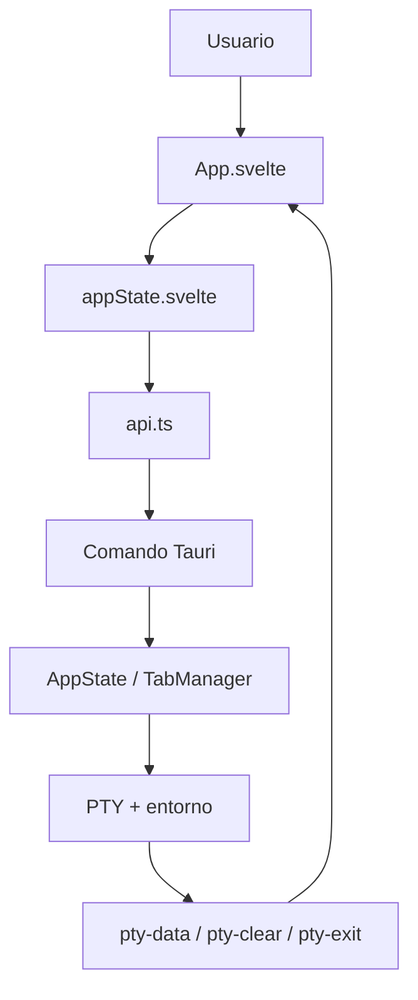
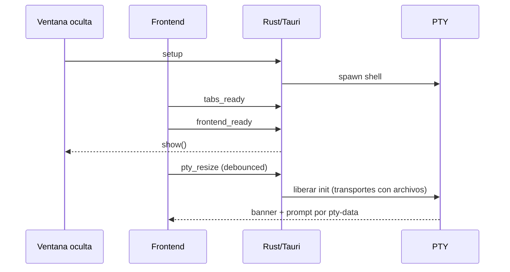
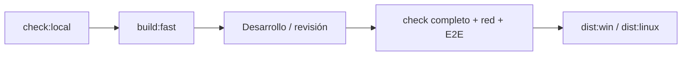

# Flujo simplificado de WinSlim Terminal

Este es el camino corto para entender, ejecutar y validar el proyecto. El
detalle exhaustivo de cada archivo continúa en
[PROJECT-FLOW.md](PROJECT-FLOW.md); aquí se agrupan las operaciones repetidas y
se separan las que necesitan infraestructura externa.

## 1. Camino principal



El frontend solo coordina estado, presentación y entrada. El backend concentra
procesos, archivos, configuración y seguridad. `api.ts` es el único puente IPC.

## 2. Arranque de una terminal

1. Tauri crea `AppState` y detecta el entorno predeterminado.
2. `TabManager` crea una pestaña y un PTY.
3. Se generan aliases, ayuda y el banner esencial.
4. El frontend monta un único xterm y comunica su tamaño.
5. La shell imprime el banner una vez y queda disponible el prompt.
6. `frontend_ready` muestra la ventana cuando ya hay contenido, evitando el
   frame blanco inicial.



En Docker/ADB/Wine el banner se antepone a la cola pendiente durante
`tabs_ready`, porque esos transportes no pueden cargar archivos temporales del
host; el resto del flujo es el mismo.

## 3. Acciones de usuario

### Ruta simple

Estas acciones siguen siempre el mismo patrón:

`clic/tecla → función Svelte → api.ts → comando Tauri → resultado → estado/UI`.

- crear, activar o cerrar pestaña;
- escribir en la terminal;
- cambiar preferencias;
- abrir/cerrar un panel;
- imprimir el banner explícito (`sysinfo` o `:banner preset full`).

### Rutas que deben permanecer segmentadas

No conviene mezclarlas con el camino simple porque tienen estados, permisos o
tiempos distintos:

| Área | Motivo de separación |
|---|---|
| PTY y resize | Hay que conservar orden de bytes, prompt, scrollback y selección. |
| Detección de entornos | WSL, Docker, ADB y Wine responden de forma asíncrona y pueden no existir. |
| Explorador de archivos | Requiere validación de rutas y operaciones potencialmente destructivas. |
| Scripts/paquetes | Usa listas blancas, gestores distintos y comandos específicos por plataforma. |
| GitHub/updater | Depende de red, releases y validación de artefactos. |
| Plugins | Cambia capacidades disponibles y necesita validar manifiestos. |

## 4. Build y validación

### Desarrollo diario

```text
npm ci              # solo una vez o al cambiar package-lock.json
npm start           # Vite + Tauri en modo desarrollo
```

### Validación local, sin red

```text
npm run check:local
npm run build:fast
```

`check:local` agrupa versión, assets, arquitectura, metadatos, documentación,
i18n, contratos y tests locales. `build:fast` ejecuta el build frontend con las
comprobaciones externas omitidas.

### Release completa

```text
npm run check
npm run dist:win          # EXE + NSIS + ZIP + smoke + E2E
npm run dist:linux        # AppImage + smoke + E2E
```

La ruta completa conserva `check:links`, `check:install-sources`, E2E y las
comprobaciones de release porque esas garantías no se pueden sustituir por
validaciones locales.



## 5. Regla práctica

Si una modificación solo afecta a Svelte, usa `check:local` y `build:fast`.
Si afecta a PTY, entornos, scripts, updater o empaquetado, ejecuta además las
pruebas Rust y la ruta completa antes de publicar.
